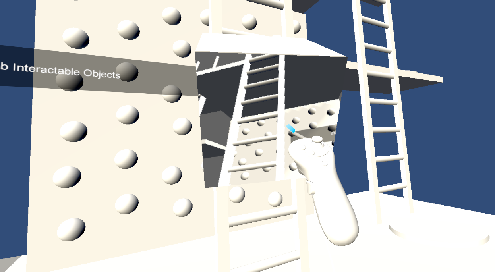
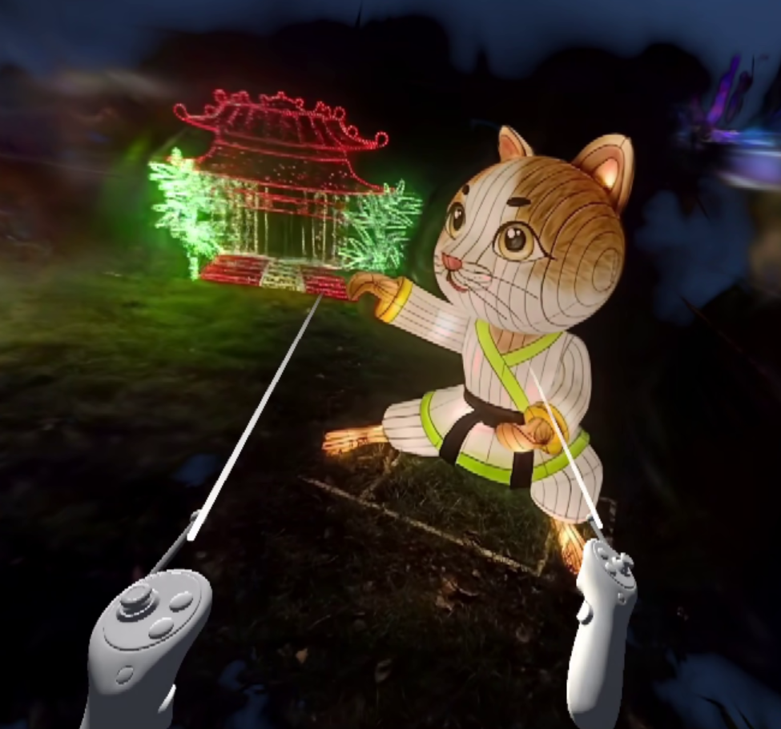
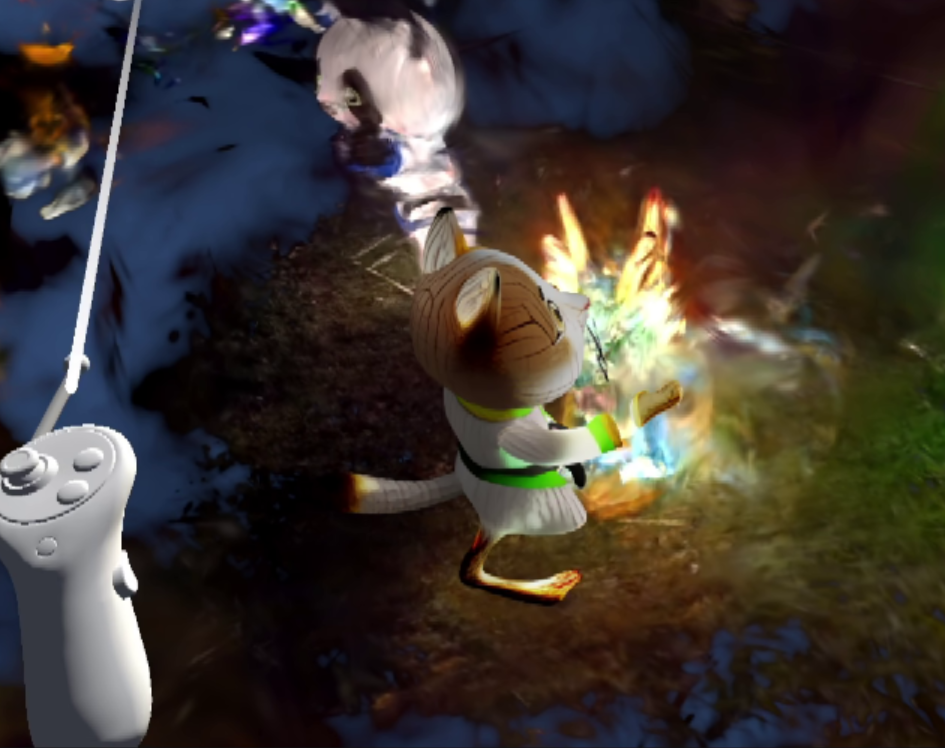

# Real-time 2D view → 3D asset generation and injection in Unity VR/AR

Automated system that converts a single in-engine Unity VR/AR user view into a 3D Gaussian Splat asset and spawns it directly in user's scene.
It allows users to dynamically generate and visualize new 3D assets based on what they see.


### Overview
The user can move and rotate this small auxiliary camera cube directly in VR to frame the desired region of interest before capture.



---

The camera captures the cropped user view, which is then converted into a 3D Gaussian Splat asset. The user can choose where to instantly spawn the generated object.

| Original VR view                     | Generated 3D Gaussian asset             |
| ------------------------------------ | --------------------------------------- |
|  |  |

---


## High‑level architecture

**One‑line:** Take a single in‑engine screenshot → generate a 3D Gaussian Splatting asset → hot‑reload it into Unity at runtime.

```mermaid
flowchart LR
  A[Unity (VR/AR) • Capture Camera\nPNG screenshot] -->|writes file| B[Watcher (Python script)]
  B -->|debounce/verify| C[Pass to TRELLIS]
  C -->|decode image→3D| D[Gaussians (.ply)]
  D --> E[RGB→SH repack\n]
  E -->|move into Assets/| F[Unity Runtime Hot‑Reload]
  F --> G[Spawn GaussianSplatAsset in front of player]
```


## Repository layout

```
.
├─ UnityGaussianSplatting/
│  └─ projects/GaussianExample/Assets/
│     ├─ Scripts/
│     │  ├─ RenderTextureClass.cs        # VR capture → PNG
│     │  └─ GaussianCreator.cs           # Hot‑reload & spawn
│     └─ …
├─ trellis/                              # local clone of TRELLIS
├─ pipeline.py                           # Windows watcher/orchestrator
├─ ply_converter.py                      # RGB→SH repacker (binary PLY)
├─ .env                                  # pipeline config (see below)
└─ README.md
```

---

## How to run

The procedure is intentionally **file‑based** so that Unity remains decoupled from the offline generation tools.

### 1) Repos and local layout

Clone:

* This pipeline + Unity project/scripts:
  `https://github.com/Nauteirius/arvr-gs-3d-asset-runtime`
* TRELLIS image→3D generator:
  `https://github.com/microsoft/TRELLIS`

Place them side‑by‑side or adapt paths in `.env` accordingly.

### 2) Create the `.env` (copy from `.example.env` and fill in your real paths

Paste your **real paths** as values:

```ini
# --- pipeline settings ---

# Where VR screenshots appear
PIPE_INPUT_FOLDER=...\screenshots

# File name to rename the screenshot (fixed name the generator reads)
PIPE_NEW_INPUT_NAME=input.png

# WSL/Linux environment (Conda env name)
PIPE_LINUX_ENV=trellis

# Path to the TRELLIS script (WSL path)
PIPE_TRELLIS_SCRIPT=.../TRELLIS/example_ply.py

# Where TRELLIS writes its outputs by default (WSL path)
PIPE_OUTPUT_FOLDER=.../TRELLIS/

# Assets folder for TRELLIS inputs (Windows path mirrored in WSL)
PIPE_TRELLIS_ASSETS_FOLDER=...\TRELLIS\assets

# Unity assets folder (Windows path)
PIPE_UNITY_ASSETS_FOLDER=...\UnityGaussianSplatting\projects\GaussianExample\Assets

# Output name after converter (Windows path destination file name)
PIPE_CONVERTER_OUTPUT_NAME=output.ply

# Conda profile (WSL path)
PIPE_CONDA_PROFILE=.../etc/profile.d/conda.sh

# Polling interval (seconds)
PIPE_POLL_INTERVAL_SEC=2
```

**Notes:**

* All **Linux/WSL paths** use `/` (forward slashes).
* The Windows path `...\TRELLIS\assets\mine` must correspond to `.../TRELLIS/assets/mine` in WSL/Linux (same folder, two views).
* `PIPE_OUTPUT_FOLDER` is where the TRELLIS script writes the raw `.ply` so the watcher can immediately pick it up.
* Make sure you have a working environment that can run TRELLIS (by default, `pipeline.py` uses the Conda environment defined by `PIPE_LINUX_ENV` inside WSL - adjust accordingly).

### 3) Set Unity‑side literals (hardcoded in scripts)

Unity scripts do **not** read `.env`. Paste the same values where indicated:

* In **`RenderTextureClass.cs`** (capture), set the screenshot path to:
  `PIPE_INPUT_FOLDER + "\\" + PIPE_NEW_INPUT_NAME`
* In **`GaussianCreator.cs`** (loader/creator), set the final `.ply` location — should point into
  `PIPE_UNITY_ASSETS_FOLDER` (the `Assets` of `projects/GaussianExample`).

After editing, place these scripts into:
`UnityGaussianSplatting/projects/GaussianExample/Assets/Scripts`

### 4) Point TRELLIS at the watcher’s input

Edit your TRELLIS entry script (e.g., `example_ply.py`) so it loads the input image from:

```
{PIPE_TRELLIS_ASSETS_FOLDER}/{PIPE_NEW_INPUT_NAME}
```


### 5) Run the watcher and interactive loop

1. In the folder with `pipeline.py`, start the watcher:

   ```bash
   python pipeline.py
   ```
2. Open `UnityGaussianSplatting/projects/GaussianExample` in **Unity 2022.3.47f1**, enable VR, and **enter Play Mode**.
3. In VR, use the auxiliary camera to frame the region of interest and take a screenshot.
4. The watcher will:

   1. detect the finished file and copy/rename it to
      `PIPE_TRELLIS_ASSETS_FOLDER\PIPE_NEW_INPUT_NAME`
   2. invoke TRELLIS under WSL/Conda
      (`PIPE_TRELLIS_SCRIPT` in `PIPE_LINUX_ENV`),
   3. wait for the Gaussian `.ply` in `PIPE_OUTPUT_FOLDER`, then move it to
      `PIPE_UNITY_ASSETS_FOLDER`,
   4. run the RGB→SH3 repacking (writes `PIPE_CONVERTER_OUTPUT_NAME` in `PIPE_UNITY_ASSETS_FOLDER`),
   5. touch a small trigger file so Unity hot‑reloads and spawns the object.

### 6) Where each value is used (consistency map)

| Key                          | Where the **value** is pasted/used besides `pipeline.py`     |
| ---------------------------- | ------------------------------------------------------------ |
| `PIPE_INPUT_FOLDER`          | `RenderTextureClass.cs`                                      |
| `PIPE_NEW_INPUT_NAME`        | TRELLIS entry script (`example_ply.py`)                      |
| `PIPE_TRELLIS_ASSETS_FOLDER` | TRELLIS entry script (`example_ply.py`)                      |
| *(others)*                   | Only in `pipeline.py` (WSL/Conda paths, output folder, etc.) |

---

## VR interaction cheatsheet (Quest 2 default)

| Controller | Control     | Action                                         |
| ---------- | ----------- | ---------------------------------------------- |
| Left       | Thumbstick  | Move around                                    |
| Left       | Trigger     | **Spawn** Gaussian asset                       |
| Right      | Thumbstick  | Rotate view; move/rotate camera cube when held |
| Right      | Side button | Grab capture camera cube                       |
| Right      | Trigger     | **Take screenshot** from capture camera        |

---

## Troubleshooting

* **No object appears in Unity**

  * Confirm a new `.ply` (and then `output.ply`) lands in `PIPE_UNITY_ASSETS_FOLDER` (ends with `/GaussianExample/Assets`).
  * Verify the TRELLIS script reads `PIPE_NEW_INPUT_NAME` from `PIPE_TRELLIS_ASSETS_FOLDER`.
  * If running TRELLIS on pure Windows (no WSL) or pure Linux, update path formats accordingly in `.env` **and** scripts.


---
## Tested on

* **OS:** Windows 11 with **WSL2** (Ubuntu 22.04)
* **Unity:** 2022.3.47f1
* **Headset:** Meta Quest 2
* **Python (Windows):** 3.10+
* **TRELLIS:** [https://github.com/microsoft/TRELLIS](https://github.com/microsoft/TRELLIS) (runs under WSL/Conda by default)

---

## Notes on representation

* TRELLIS emits per‑splat attributes: **position**, **scale**, **rotation**, **opacity**, **RGB color**.
* The converter repacks color to **spherical harmonics (SH3)** and writes a **tight little‑endian binary PLY** with **fixed vertex stride**.
* Geometry is preserved verbatim; only color layout changes to match the Unity viewer.

